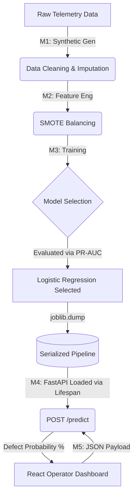

# 🏭 Advanced AI/ML: Semiconductor Quality Intelligence

Welcome to the **Semiconductor Defect Prediction** system. This repository demonstrates an end-to-end Machine Learning pipeline applied to a highly complex industrial use-case: predicting rare manufacturing defects on silicon wafers based on equipment telemetry, environmental sensors, and historical context.

---

## 🚀 How to Run the System

We have configured a unified startup pipeline to run both the FastAPI Backend and the React Frontend simultaneously.

<details>
<summary><b>Click here to see the 2-step startup instructions!</b></summary>

1. **Install Python Dependencies (Once)**
   Open a terminal in the root directory:
   ```bash
   pip install -r requirements.txt
   ```

2. **Start the Unified Pipeline**
   ```bash
   cd frontend
   npm install
   npm run dev
   ```
   
   *This command leverages `concurrently` to automatically start both the FastAPI backend (on port `8000`) and the Vite React frontend (on port `5173`) in the same terminal instance!*

3. **Access the Dashboard**
   Navigate to [http://localhost:5173](http://localhost:5173) in your browser to interact with the prediction UI.
</details>

---

## 🧠 Educational Breakdown: How This System Works

This project is divided into 5 distinct milestones, each solving a critical problem in the Machine Learning lifecycle.

### Milestone 1: Data Engineering
> **The Problem**: Real semiconductor data is proprietary. How do we build a model without data?
> **The Solution**: We synthesized 25,000 realistic wafer records. Crucially, we injected **Correlated Anomalies** (e.g., defects trigger more often when high temperature interacts with high pressure) and **Sensor Drift** (equipment aging over time).

### Milestone 2: Handling the "Needle in a Haystack" (SMOTE)
> **The Problem**: Defects are rare (only 8.3% of the dataset). If an ML model just guessed "Normal" every time, it would be 91.7% accurate, but entirely useless for catching defects!
> **The Solution**: We utilized **SMOTE (Synthetic Minority Over-sampling Technique)** inside an `imblearn` pipeline to safely balance the training data to a 50/50 split without leaking data into the testing set.

### Milestone 3: The Metric that Matters (PR-AUC)
> **The Problem**: Standard ROC-AUC can be overly optimistic on highly imbalanced datasets.
> **The Solution**: We evaluated Logistic Regression and XGBoost using **PR-AUC (Precision-Recall Area Under Curve)**. Interestingly, because we engineered excellent linear features in M2 (like explicit temperature deviations), the baseline Logistic Regression model easily captured the risk profile and outperformed XGBoost's Recall!

### Milestone 4 & 5: Productionization
The serialized `.joblib` model is served via a **FastAPI** backend endpoint (`/predict`). A **React** frontend consumes this API, allowing floor operators to input real-time telemetry and instantly view the defect risk classification.

---

## 🏗️ System Architecture



---

*Explore the `docs/` folder for deeper technical documentation on each milestone.*
