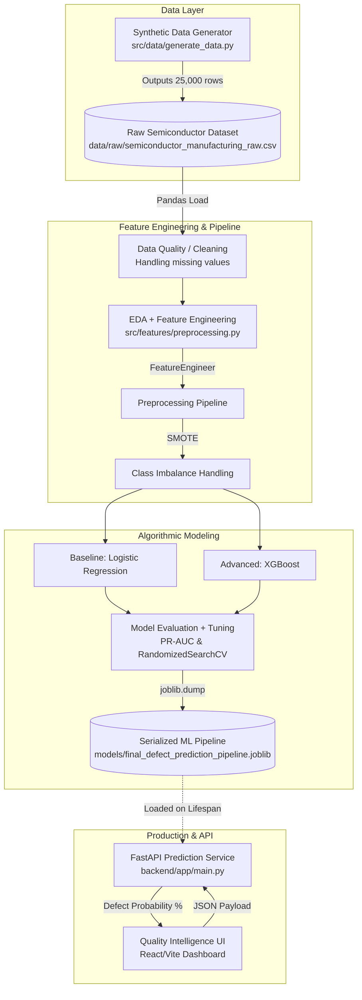

# System Architecture

The following diagram illustrates the exact data, model, and inference flow of the implemented Semiconductor Manufacturing Defect Prediction system.

## Architectural Responsibilities

1. **Synthetic Data Generator (`generate_data.py`)**: Responsible for injecting domain-specific thermal anomalies, equipment degradation over time (drift), and realistic missing data patterns into a synthetic wafer dataset.
2. **Preprocessing Pipeline (`preprocessing.py`)**: A modular scikit-learn pipeline wrapping custom transformers (`FeatureEngineer`), imputation, scaling, and `imblearn`'s SMOTE. Responsible for ensuring no data leaks occur between training folds.
3. **Training Script (`train_model.py`)**: Responsible for utilizing `GroupShuffleSplit` (on `batch_id`) to strictly separate dependent wafers, running hyperparameter tuning, and selecting the best model based on PR-AUC.
4. **FastAPI Service (`main.py`)**: Responsible for strong Pydantic validation (rejecting malformed inputs) and hosting the `joblib` pipeline efficiently via a lifespan context manager.
5. **React Dashboard (`App.tsx`)**: Responsible for the operator-facing interface, capturing telemetry, and translating probabilities into color-coded operational Risk Thresholds.
